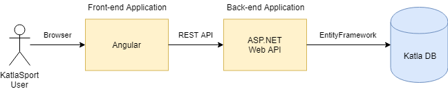
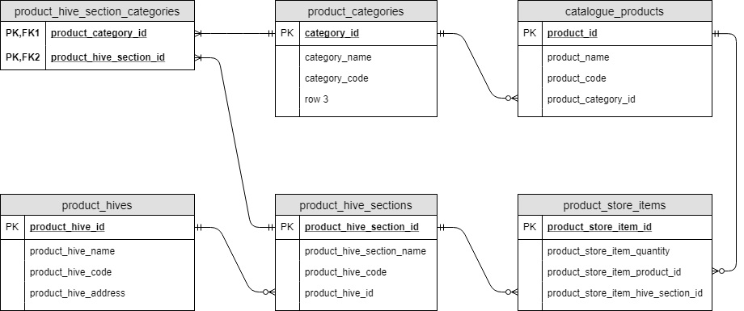
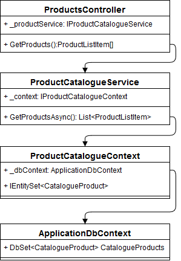
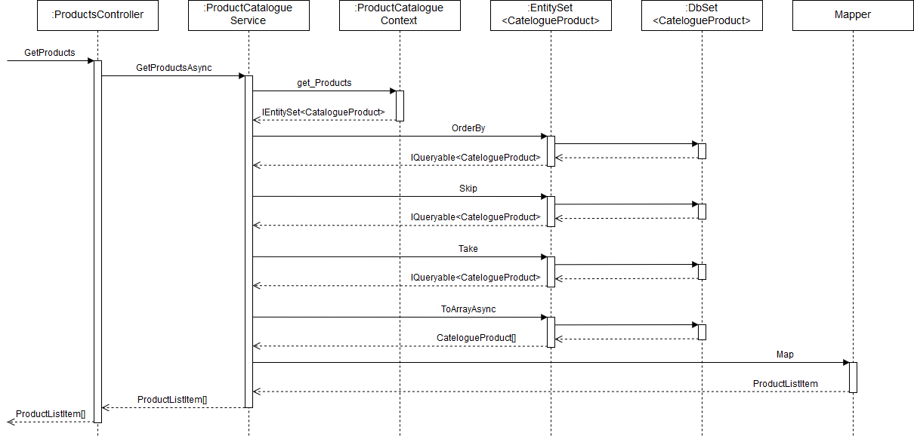
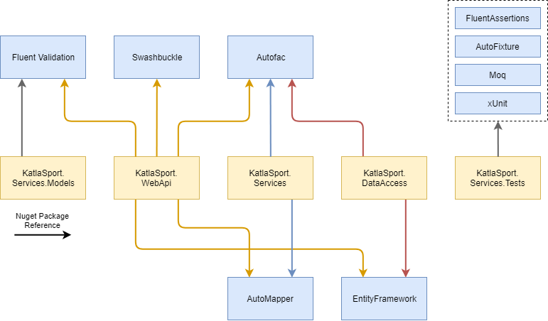

# KatlaSport Project

## Описание проекта

### Структура приложения



Приложение KatlaSport построено по классической [трехуровневой архитектуре](https://ru.wikipedia.org/wiki/Трёхуровневая_архитектура) и состоит из следующих компонентов:

* KatlaDB - реляционная база данных, которая хранит состояние приложения в виде таблиц. В текущем приложении не имеет внутренней логики (в виде хранимых процедур и проч.).
* Back-end Application - отдельное .NET приложение, которое реализует веб-сервис.
* Front-end Application - отдельное приложение, которое работает в браузере пользователя. Построено с помощью [Angular](https://angular.io). Доставляется в браузер пользователя через отдельный endpoint, обращается к back-end application через REST API.

### База данных

Структура базы представлена на рисунке ([подсказка по типам реляционных связей](http://www.risetobloome.com/Page_1_S.aspx?ITEM=616)):



* Таблица "product_categories" хранит категории продуктов.
* Таблица "catalogue_products" хранит описание продуктов. Каждый продукт принадлежит одной категории.
* Таблица "product_hives" хранит данные отдельного склада.
* Таблица "product_hive_sections" хранит информацию о складской секции.
* Каждая секция может хранить только те продукты, категории которых привязаны к данной секции через таблицу "product_hive_section_categories".
* Таблица "product_store_items" хранит данные о конкретном продукте, который находится в конкретной секции.

### Описание Back-end Application

Веб-сервис построен на базе [ASP.NET WebAPI](https://www.asp.net/web-api) и предоставляет внешнее API, построенное [в архитектурном стиле REST](http://www.restapitutorial.com/lessons/whatisrest.html). Доступ к БД осуществляется через EntityFramework.

Приложение состоит из нескольких проектов:

  * KatlaSport.WebApi - приложение ASP.NET, предоставляет REST API.
  * KatlaSport.Services.Models - проект, в котором находятся модели.
  * KatlaSport.Services - проект, в котором находятся сервисы.
  * KatlaSport.Services.Tests - проект, в котором находятся unit-tests для сервисов.
  * KatlaSport.DataAccess - проект, в котором находятся сущности для работы EntityFramework.

#### Проектные зависимости

На диаграмме "Project and Class Reference" показаны зависимости между проектами. [Управлять зависимостями](https://www.youtube.com/results?search_query=visual+studio+project+reference) можно через Visual Studio.

Наличие "Project Reference" значит, что проект имеет ссылку на другой проект. Например, проект KatlaSport.WebApi имеет ссылку на Katla.Sport.Services.Models.

Наличие "Class Reference" значит что классы проекта имеют ссылку на классы в другом проекте. Например, классы контроллеров в KatlaSport.WebApi используют классы из Katla.Sport.Services.Models.


Обратите внимание, что проект может иметь ссылку на зависимый проект, но при этом классы этого проекта не зависят от классов зависимого проекта. Например, классы KatlaSport.WebApi не используют напрямую классы сервисов KatlaSport.Services.

#### Изменение версии фреймворка

Проекты настроены для .NET-фреймворка версии 4.7.1, однако допускается использование другой версии фреймворка. Изменить версию фреймворка можно [с помощью Visual Studio](https://msdn.microsoft.com/en-us/library/ff770576.aspx) или вручную (изменив файлы проектов):

```xml
<TargetFrameworkVersion>v4.7.1</TargetFrameworkVersion>
```

#### Особенности проектных файлов

При совместной работе нескольких разработчиков над одним проектом часто во время слияния возникают конфликты. Типичный случай - несколько разработчиков одновременно добавляют и удаляют файлы из проекта. Чтобы избежать конфликтов в проектных файлах можно использовать [wildcards](https://blogs.msdn.microsoft.com/msbuild/2006/03/08/how-to-exclude-multiple-files-from-a-wildcard/). Эта техника используется во проектных файлов KatlaSport.

Например, *KatlaSport.Services.csproj*:

```xml
<Project ToolsVersion="15.0" xmlns="http://schemas.microsoft.com/developer/msbuild/2003">
  ...
  <ItemGroup>
    <Compile Include="**\*.cs" Exclude="obj\Debug\*.cs;obj\Release\*.cs" />
  </ItemGroup>
  ...
</Project>
```

Исключение - файл проект *KatlaSport.DataAccess*. Этот проектный файл содержит ссылки на файлы миграций:

```xml
<ItemGroup>
  <Compile Include="**\*.cs" Exclude="obj\Debug\*.cs;obj\Release\*.cs;Migrations\*.*" />
  <Compile Include="Migrations\201805141011374_InitialCreate.cs" />
  <Compile Include="Migrations\201805141011374_InitialCreate.Designer.cs">
    <DependentUpon>201805141011374_InitialCreate.cs</DependentUpon>
  </Compile>
  <Compile Include="Migrations\Configuration.cs" />
</ItemGroup>
<ItemGroup>
  <EmbeddedResource Include="Migrations\201805141011374_InitialCreate.resx">
    <DependentUpon>201805141011374_InitialCreate.cs</DependentUpon>
  </EmbeddedResource>
</ItemGroup>
```

#### Пример работы классов





### Описание Front-end Application

### Пакеты back-end

В Back-end Application широко используюты дополнительные NuGet-пакеты, которые позволяют расширить функциональность приложения. Внешние зависимости на другие пакеты увеличивают сложность приложения и усложняют сборку, однако это компенсируется дополнительной функциональностью, повышением качества и уменьшением количества кода основного приложения.



* [Swashbuckle](https://github.com/domaindrivendev/Swashbuckle).
* [FluentValidation](https://github.com/JeremySkinner/FluentValidation).
* [AutoMapper](https://automapper.org).
